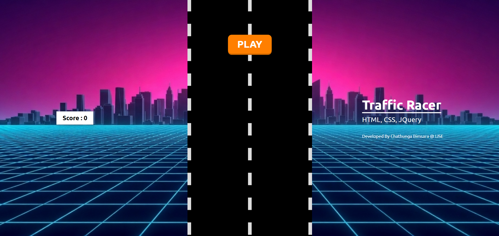

# Traffic Racer 2D

A retro-synthwave inspired 2D racing game built entirely using **HTML, CSS, and jQuery**. 
This game was developed using pure Object-Oriented Programming (OOP) concepts in JavaScript (without using any external game engines or frameworks).

## 📸 Game Preview

## ✨ Features

- **Pure JavaScript OOP**: Implemented using prototype chains (`GameObject`, `Car`, `Player`, `Enemy`).
- **Dynamic Difficulty**: Includes a minimum of 4 difficulty levels. As your score increases, you level up, which increases the road animation speed, enemy car speed, and enemy spawn rate.
- **Collision Detection**: Precise Axis-Aligned Bounding Box (AABB) collision detection between the player's car and incoming traffic.
- **Persistent High Score**: Saves your highest score locally using `localStorage` so it persists between sessions.
- **Aesthetic UI**: Smooth CSS animations, responsive layouts, and retro "Press Start 2P" typography for a polished arcade feel.

## 🚀 How to Play

1. Open `index.html` in any modern web browser.
2. Click the **PLAY** button to start the engine!
3. **Controls**:
   - Use the **Left Arrow** and **Right Arrow** keys to steer your car.
   - Use the **Up Arrow** and **Down Arrow** keys to control your speed/position vertically.
4. Dodge the incoming orange traffic cars. Your score increases passively over time and each time you successfully pass an enemy car.
5. If you crash, click **PLAY AGAIN** on the Game Over screen to retry and beat your high score!

## 🛠️ Technologies Used

- **HTML5**: For the structural layout of the game board and UI screens.
- **Vanilla CSS3**: Used for responsive positioning, UI styling, and the infinite scrolling road animation.
- **jQuery (v3.7.1)**: Used for rapid DOM manipulation, event handling, and game loop management.